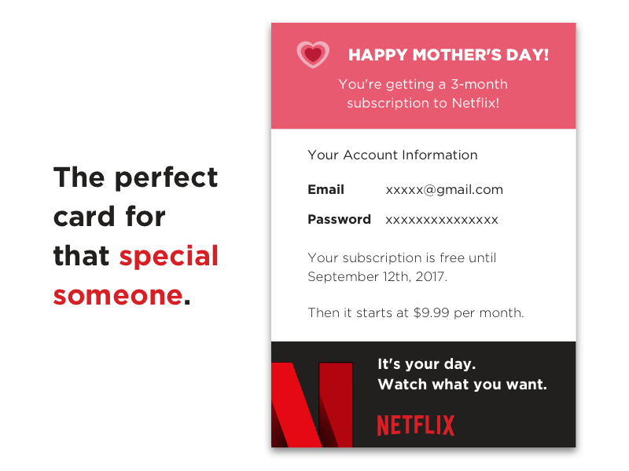

# mothersday-netflix

   

A gift card for a Netflix subscription on Mother's Day! 💖

- [View this project on Behance](https://www.behance.net/gallery/52666369/Mothers-Day-Card-Netflix-Subscription?share=1)

## Installation

Download and edit this template using Sketch and present it to your mom for the perfect gift!

## Contributing

> To get started...

- 🍴 Fork this repo [here](https://github.com/fvcproductions/mothersday-netflix#fork-destination-box)
- 🔨 Hack away
- 👥 Add yourself as a contributor under credits
- 🔧 Make a pull request [here](https://github.com/fvcproductions/mothersday-netflix/compare)
- 🎉 Get your pull request approved - success!

Or just [create an issue](https://github.com/fvcproductions/mothersday-netflix/issues) - any little bit of help counts! 😊

## Credits

- [FVCproductions](http://fvcproductions.com) 🍓🍫